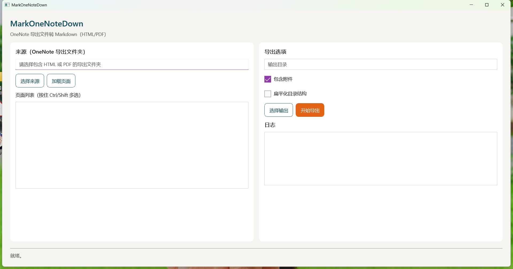

# MarkOneNoteDown

Windows (WinUI 3) 工具：将 OneNote 导出内容转换为 Markdown（含图片与附件）。



## 版本信息
- 应用版本：1.0.0.0
- 目标框架：net8.0-windows10.0.19041.0
- 最低系统版本：Windows 10 19041
- Windows App SDK：1.8.251106002
- 发布方式：非 MSIX（传统 EXE）+ Inno Setup 单文件安装包

## 目标与范围
- 支持选择笔记本/分区/页面并导出为 Markdown
- 保持标题层级、列表、表格、代码块、任务清单等结构
- 导出图片与附件，并在 Markdown 中用相对路径引用
- 提供可视化进度与日志面板，支持批量导出

## 技术选型
- 语言与运行时：C# + .NET 8
- UI：WinUI 3
- Markdown 生成：Markdig
- 日志：Serilog（文件 + UI 控件）
- 配置：appsettings.json + 用户设置

## 依赖与前置条件
- Windows 10/11
- .NET 8 SDK
- Windows App Runtime（WinUI 3 运行时）
- WebView2 Runtime（系统通常已预装）

### 验证安装
在 PowerShell 执行：
```powershell
dotnet --info
```
能正常输出 .NET 版本信息即表示 SDK 可用。

再执行：
```powershell
Get-AppxPackage Microsoft.WindowsAppRuntime*
```
能看到 Microsoft.WindowsAppRuntime.* 条目则运行时已安装。

## 构建与运行（开发）
命令行：
```powershell
dotnet restore
dotnet build MarkOneNoteDown.sln
```

运行：
```powershell
dotnet run --project src\MarkOneNoteDown.App\MarkOneNoteDown.App.csproj
```

## 构建脚本
项目自带脚本 `scripts/build_run_clean.ps1`，支持清理、构建、运行：
```powershell
# 清理 + 构建 + 运行（默认）
powershell -ExecutionPolicy Bypass -File scripts\build_run_clean.ps1

# 仅清理
powershell -ExecutionPolicy Bypass -File scripts\build_run_clean.ps1 -Action clean

# 仅构建
powershell -ExecutionPolicy Bypass -File scripts\build_run_clean.ps1 -Action build

# 仅运行
powershell -ExecutionPolicy Bypass -File scripts\build_run_clean.ps1 -Action run
```

## 导出说明（当前实现）
- 页面支持多选导出（在 Pages 列表中按住 Ctrl/Shift）
- 未选择任何页面时，默认导出当前加载的全部页面
- Markdown 当前为基础文本抽取版本（后续会扩展标题/列表/表格/图片映射）

## OneNote HTML 导出流程（推荐）
1. 在 OneNote 桌面版选择笔记本或分区
2. 使用 OneNote 的“导出”为 HTML（生成一个包含多个 *.html 的文件夹）
3. 在应用中选择该导出文件夹作为 Source
4. 选择输出目录并导出为 Markdown

## PDF 支持
当导出目录中包含 `*.pdf` 文件时，会进行文本提取并转换为 Markdown。
注意：当前使用 iText（AGPL 商业授权要求），若用于闭源/商业项目请确认许可合规。

## 配置（可选）
可在 `appsettings.json` 中配置默认源目录：
```json
{
  "SourceFolder": ""
}
```
`SourceFolder` 非空时，启动自动加载该目录的 HTML 页面。

## 使用 VS Code（构建与运行）
准备：
- 安装 VS Code 扩展：C# Dev Kit（含 C#、.NET 调试支持）
- 确认已安装 .NET 8 SDK 与 Windows App Runtime

构建：
```powershell
dotnet restore
dotnet build MarkOneNoteDown.sln
```

运行：
```powershell
dotnet run --project src\MarkOneNoteDown.App\MarkOneNoteDown.App.csproj
```

## EXE 打包（不使用 MSIX）
改为传统 EXE 发布流程，不生成 MSIX 安装包。请使用以下脚本生成可运行的 EXE 目录：
```powershell
powershell -ExecutionPolicy Bypass -File scripts\publish_exe.ps1
```
输出位置：
- `artifacts\exe\`
- 运行 `artifacts\exe\MarkOneNoteDown.App.exe`

可选参数：
- `-Configuration Release|Debug`
- `-Runtime win-x64`
- `-SelfContained:$true|$false`
- `-OutputDir "artifacts\exe"`

注意：即使是 EXE 发布，WinUI 3 仍依赖 Windows App Runtime；如果运行无反应，请先检查运行时是否安装。

## 单文件安装包（Inno Setup）
需要单文件安装包（EXE 安装器）时，请先安装 Inno Setup 并确保 `ISCC.exe` 在 PATH 中。

生成安装包：
```powershell
powershell -ExecutionPolicy Bypass -File scripts\package_installer.ps1
```

输出位置：
- `artifacts\installer\MarkOneNoteDown-Setup.exe`

说明：
- 脚本会先执行 `publish_exe.ps1` 生成发布目录，再打包成安装器。

## 目录结构（建议）
```
src/
  MarkOneNoteDown.App/          WinUI 3 入口 UI
  MarkOneNoteDown.Core/         解析与渲染核心逻辑
  MarkOneNoteDown.OneNote/      OneNote 导出读取
  MarkOneNoteDown.Export/       导出流程与任务调度
  MarkOneNoteDown.Tests/        单元与集成测试
```

## 备注
OneNote 原生 `.one`/`.onetoc2` 文件不可直接解析，推荐通过 OneNote 导出为 HTML/PDF 后进行转换。
